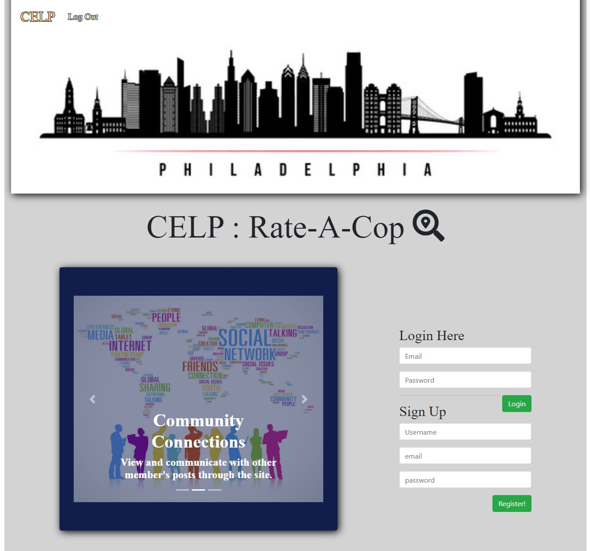

# CELP: The Rate-a-Cop App
# Description 
With the issue of police brutality being a prevalent and pressing social issue, there seems to be a disconnect between the public and information given in regards recorded events between the community and online records/databases. More specifically, there is a big discrepancy between the number of public records being logged in lower-income areas verse higher-income neighborhoods. 
As our group did further research, we found there are gaps in weeks, months and even years in the databases for crimes recorded in Philadelphia. Police records and events are not documented in public records as regularly as one would imagine them to be. 
Our purpose with the CELP app is to eliminate that disconnection between Philadelphian residents and the incidents or events taking place around them. What our site does specifically is hone in on the one-on-one interactions between police and the the citizens of Philadelphia. CELP in the short-scheme of things can be considered to be a social media website, used for social activist groups and their leaders. By collecting user data, we will be able to map out specific occurrences with police and the public but more importantly this will be a host to finding the source of where problematic areas are actively occurring and rising in the greater Philadelphia area.
When a user enters the site they will be prompted on signing up/registering their username, email, and password or logging in with their credentials. When they have logged in, they will be routed to their home page, which will be filled with posts from not only their self but the users from all over the greater Philadelphia community. Each time someone has an interaction with police, whether good or bad, they will have this CELP as a resource to log that and display that information to the public around them. 
Using the Google Maps API, we offer the user the accessability of selecting a pin on the Google map and tagging where each event took place. The collection of all this data will result in our heat map radar- which displays where areas are more prone to police interaction with the public.
# Table of Contents 
* [Installation](#installation)
* [Usage](#usage)
* [License](#license)
* [Contributors](#contributors)
* [Test](#test)
* [Questions](#questions)
* [Contact](#contact)
# Installation
 
To install the necessary dependencies, run the following command: 
npm i.

# License
None

# Contributors
* [Andrew Hall](https://github.com/AndrewbHall96)
* [Christopher Turton](https://github.com/Turtando) 
* [Chelsey Craig](https://github.com/ccraig7321) 
* [Josh Homer](https://github.com/jchomer90) 
* [Tim Winters](https://github.com/erasersleeve)
# Future Developments
Future development plans for this project include
# Questions
*If you have any questions about the repository, open an issue or contact us directly at [Andrew Hall](https://github.com/AndrewbHall96) / [Christopher Turton](https://github.com/Turtando) / [Chelsey Craig](https://github.com/ccraig7321) / [Josh Homer](https://github.com/jchomer90) / [Tim Winters](https://github.com/erasersleeve) on GitHub or, you email directly at andrewbhall96@gmail.com / christopheraturton@gmail.com / chelsey.craig7321@gmail.com / joshuachomer@gmail.com / timwinters99@gmail.com.*
